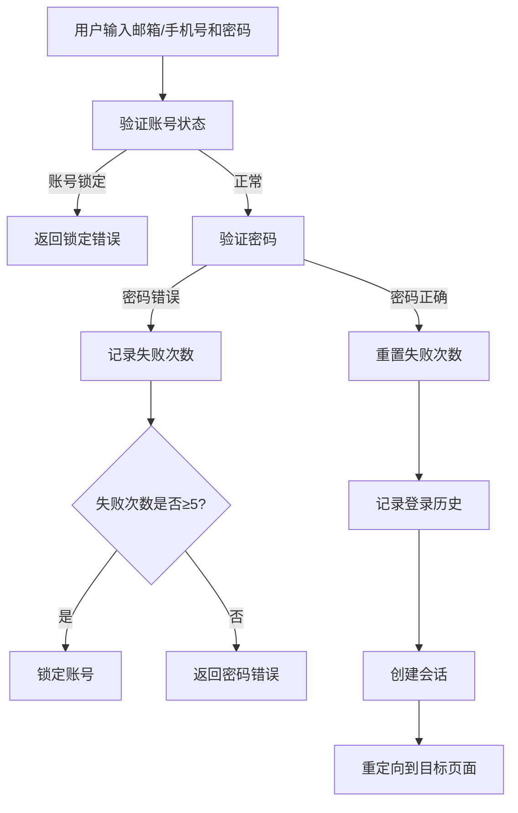
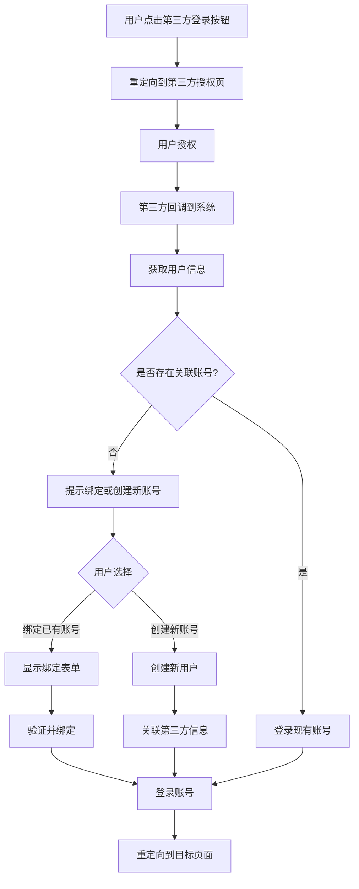
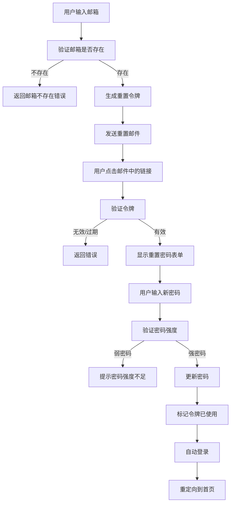

# 用户认证功能设计文档

## 1. 简介

### 1.1 文档目的
本文档详细描述了存储管理系统用户认证功能的技术实现方案，基于需求文档中的功能需求和非功能需求，提供系统架构、数据模型、API设计和前端界面设计等技术细节，作为开发人员的实现指南。

### 1.2 术语定义

| 术语 | 解释 |
| :--- | :--- |
| OAuth2 | 开放授权协议，允许用户授权第三方应用访问其在另一服务上的资源 |
| JWT | JSON Web Token，一种用于在网络应用间安全传递声明的开放标准 |
| CSRF | 跨站请求伪造，一种网络攻击方式 |
| SMTP | 简单邮件传输协议，用于发送电子邮件 |
| 中间件 | Django中的一种处理请求和响应的钩子框架 |

## 2. 架构设计

### 2.1 系统架构概览

```
┌─────────────┐     ┌─────────────┐     ┌─────────────┐
│  前端界面   │────▶│  Django视图 │────▶│  认证服务   │
└─────────────┘◀────┘─────────────┘◀────┘─────────────┘
                               │
                        ┌──────▼──────┐
                        │   数据库    │
                        └─────────────┘
                               │
              ┌───────────────┴───────────────┐
      ┌───────▼──────┐               ┌───────▼──────┐
      │ 第三方OAuth2 │               │  外部服务    │
      │  提供商      │               │(邮箱/短信)   │
      └─────────────┘               └─────────────┘
```

### 2.2 技术栈选择

| 分类 | 技术/框架 | 版本 | 用途 | 选型理由 |
| :--- | :--- | :--- | :--- | :--- |
| 后端框架 | Django | 4.2+ | Web框架 | 成熟稳定，内置认证系统，ORM强大 |
| 认证扩展 | Django Allauth | 0.59.0+ | 第三方登录集成 | 支持多种OAuth2提供商，与Django完美集成 |
| 数据库 | PostgreSQL | 14.0+ | 数据存储 | 支持复杂查询，性能优秀，适合生产环境 |
| 缓存 | Redis | 7.0+ | 会话存储、验证码缓存 | 高性能键值存储，支持过期策略 |
| 前端框架 | Bootstrap | 5.3+ | UI组件库 | 响应式设计，移动友好，组件丰富 |
| JavaScript | jQuery | 3.7+ | DOM操作 | 简化前端交互，与Bootstrap良好配合 |
| 密码哈希 | bcrypt | 内置 | 密码安全存储 | 安全性高，抗彩虹表攻击 |

### 2.3 核心模块与职责

| 模块 | 主要职责 | 文件位置 | 依赖关系 |
| :--- | :--- | :--- | :--- |
| 认证核心 | 用户登录、注册、会话管理 | users/views.py, users/forms.py | Django auth, forms |
| 用户模型 | 用户数据结构定义和管理 | users/models.py | Django AbstractUser |
| 第三方认证 | OAuth2集成与管理 | users/oauth.py | Django Allauth |
| 密码重置 | 邮箱/手机号密码重置 | users/views.py, users/tokens.py | Django tokens, SMTP |
| 验证码服务 | 生成和验证验证码 | users/utils.py | Redis, 短信API |
| 安全中间件 | 提供CSRF保护、XSS防御 | users/middleware.py | Django middleware |

## 3. 数据模型设计

### 3.1 ER图

```
┌─────────────┐      ┌─────────────────────┐
│    User     │──────│  SocialAccount      │
└─────────────┘      └─────────────────────┘
       │                       │
       │                       │
       ▼                       ▼
┌─────────────┐      ┌─────────────────────┐
│  UserToken  │      │   VerificationCode  │
└─────────────┘      └─────────────────────┘
       │
       │
       ▼
┌─────────────┐
│ LoginHistory│
└─────────────┘
```

### 3.2 核心数据结构定义

#### 3.2.1 用户模型 (User)

| 字段名 | 数据类型 | 约束 | 描述 |
| :--- | :--- | :--- | :--- |
| id | AutoField | Primary Key | 用户ID |
| username | CharField | Unique, 30字符 | 用户名（系统生成） |
| email | EmailField | Unique, Nullable | 邮箱地址 |
| phone_number | CharField | Unique, Nullable, 11字符 | 手机号码 |
| password | CharField | 128字符 | 密码哈希 |
| is_active | BooleanField | Default=True | 账号是否激活 |
| last_login_attempts | IntegerField | Default=0 | 连续登录失败次数 |
| account_locked_until | DateTimeField | Nullable | 账号锁定截止时间 |
| created_at | DateTimeField | AutoNowAdd | 创建时间 |
| updated_at | DateTimeField | AutoNow | 更新时间 |

#### 3.2.2 第三方账号关联 (SocialAccount)

| 字段名 | 数据类型 | 约束 | 描述 |
| :--- | :--- | :--- | :--- |
| id | AutoField | Primary Key | 记录ID |
| user_id | ForeignKey | User.id | 关联用户ID |
| provider | CharField | 50字符 | 第三方平台标识(wechat/qq/alipay) |
| provider_user_id | CharField | 100字符 | 第三方平台用户ID |
| access_token | CharField | 255字符 | 访问令牌 |
| refresh_token | CharField | 255字符, Nullable | 刷新令牌 |
| expires_at | DateTimeField | Nullable | 令牌过期时间 |
| created_at | DateTimeField | AutoNowAdd | 创建时间 |
| updated_at | DateTimeField | AutoNow | 更新时间 |

#### 3.2.3 密码重置令牌 (UserToken)

| 字段名 | 数据类型 | 约束 | 描述 |
| :--- | :--- | :--- | :--- |
| id | AutoField | Primary Key | 记录ID |
| user_id | ForeignKey | User.id | 关联用户ID |
| token_type | CharField | 20字符 | 令牌类型(password_reset/email_verify) |
| token | CharField | 100字符 | 令牌值 |
| expires_at | DateTimeField | 不可空 | 过期时间 |
| is_used | BooleanField | Default=False | 是否已使用 |
| created_at | DateTimeField | AutoNowAdd | 创建时间 |

#### 3.2.4 验证码 (VerificationCode)

| 字段名 | 数据类型 | 约束 | 描述 |
| :--- | :--- | :--- | :--- |
| id | AutoField | Primary Key | 记录ID |
| target | CharField | 100字符 | 目标邮箱或手机号 |
| code | CharField | 20字符 | 验证码 |
| code_type | CharField | 20字符 | 验证码类型(register/password_reset) |
| expires_at | DateTimeField | 不可空 | 过期时间 |
| is_used | BooleanField | Default=False | 是否已使用 |
| created_at | DateTimeField | AutoNowAdd | 创建时间 |
| attempts | IntegerField | Default=0 | 尝试验证次数 |

#### 3.2.5 登录历史 (LoginHistory)

| 字段名 | 数据类型 | 约束 | 描述 |
| :--- | :--- | :--- | :--- |
| id | AutoField | Primary Key | 记录ID |
| user_id | ForeignKey | User.id | 关联用户ID |
| login_time | DateTimeField | AutoNowAdd | 登录时间 |
| ip_address | CharField | 50字符 | IP地址 |
| user_agent | TextField | Nullable | 用户代理 |
| login_method | CharField | 50字符 | 登录方式(password/wechat/qq/alipay) |
| is_successful | BooleanField | Default=True | 是否登录成功 |
| error_message | TextField | Nullable | 错误信息 |

## 4. API 接口设计

### 4.1 认证核心接口

| API路径 | 方法 | 模块/文件 | 类型 | 功能描述 | 请求体 (JSON) | 成功响应 (200 OK) |
| :--- | :--- | :--- | :--- | :--- | :--- | :--- |
| /accounts/login/ | POST | users/views.py | View | 邮箱/手机号登录 | `{"email_or_phone": "...", "password": "...", "remember_me": true}` | `{"success": true, "next_url": "/dashboard/"}` |
| /accounts/register/ | POST | users/views.py | View | 用户注册 | `{"email": "...", "phone_number": "...", "password": "...", "confirm_password": "..."}` | `{"success": true, "next_url": "/dashboard/"}` |
| /accounts/logout/ | GET | users/views.py | View | 用户登出 | N/A | 重定向到首页 |
| /accounts/profile/ | GET | users/views.py | View | 用户个人资料 | N/A | HTML页面 |
| /accounts/profile/ | POST | users/views.py | View | 更新个人资料 | `{"email": "...", "phone_number": "..."}` | `{"success": true, "message": "更新成功"}` |

### 4.2 密码管理接口

| API路径 | 方法 | 模块/文件 | 类型 | 功能描述 | 请求体 (JSON) | 成功响应 (200 OK) |
| :--- | :--- | :--- | :--- | :--- | :--- | :--- |
| /accounts/password/reset/ | GET | users/views.py | View | 密码重置表单 | N/A | HTML页面 |
| /accounts/password/reset/ | POST | users/views.py | View | 申请密码重置 | `{"email": "..."}` 或 `{"phone_number": "..."}` | `{"success": true, "message": "验证码已发送"}` |
| /accounts/password/reset/verify/ | POST | users/views.py | View | 验证重置令牌/验证码 | `{"token": "..."}` 或 `{"phone_number": "...", "code": "..."}` | `{"success": true}` |
| /accounts/password/reset/confirm/ | POST | users/views.py | View | 设置新密码 | `{"token": "...", "new_password": "...", "confirm_password": "..."}` | `{"success": true, "next_url": "/accounts/login/"}` |
| /accounts/password/change/ | POST | users/views.py | View | 修改密码 | `{"old_password": "...", "new_password": "...", "confirm_password": "..."}` | `{"success": true, "message": "密码修改成功"}` |

### 4.3 第三方认证接口

| API路径 | 方法 | 模块/文件 | 类型 | 功能描述 | 请求体 | 成功响应 |
| :--- | :--- | :--- | :--- | :--- | :--- | :--- |
| /accounts/oauth/wechat/ | GET | users/oauth.py | View | 微信登录授权 | N/A | 重定向到微信授权页 |
| /accounts/oauth/wechat/callback/ | GET | users/oauth.py | View | 微信授权回调 | Query参数：code | 重定向到首页或绑定页 |
| /accounts/oauth/qq/ | GET | users/oauth.py | View | QQ登录授权 | N/A | 重定向到QQ授权页 |
| /accounts/oauth/qq/callback/ | GET | users/oauth.py | View | QQ授权回调 | Query参数：code | 重定向到首页或绑定页 |
| /accounts/oauth/alipay/ | GET | users/oauth.py | View | 支付宝登录授权 | N/A | 重定向到支付宝授权页 |
| /accounts/oauth/alipay/callback/ | GET | users/oauth.py | View | 支付宝授权回调 | Query参数：code | 重定向到首页或绑定页 |
| /accounts/connect/ | POST | users/views.py | View | 绑定第三方账号 | `{"provider": "...", "action": "bind/unbind"}` | `{"success": true, "message": "操作成功"}` |

### 4.4 验证码接口

| API路径 | 方法 | 模块/文件 | 类型 | 功能描述 | 请求体 (JSON) | 成功响应 (200 OK) |
| :--- | :--- | :--- | :--- | :--- | :--- | :--- |
| /accounts/send-code/ | POST | users/views.py | View | 发送验证码 | `{"phone_number": "...", "purpose": "..."}` | `{"success": true, "message": "验证码已发送"}` |
| /accounts/verify-code/ | POST | users/views.py | View | 验证验证码 | `{"phone_number": "...", "code": "..."}` | `{"success": true}` |

## 5. 前端界面设计

### 5.1 页面布局架构

```
┌─────────────────────────────────────────────────────────┐
│                        导航栏                             │
├─────────────────────────────────────────────────────────┤
│                                                         │
│                     主内容区域                           │
│                                                         │
│  ┌─────────────────────────────────────────────────┐    │
│  │                   认证卡片                        │    │
│  │  ┌─────────────────────────────────────────┐    │    │
│  │  │               表单区域                   │    │    │
│  │  └─────────────────────────────────────────┘    │    │
│  │                                                 │    │
│  │  ┌─────────────────────────────────────────┐    │    │
│  │  │              第三方登录区域              │    │    │
│  │  └─────────────────────────────────────────┘    │    │
│  └─────────────────────────────────────────────────┘    │
│                                                         │
│
├─────────────────────────────────────────────────────────┤
│                        页脚                              │
└─────────────────────────────────────────────────────────┘
```

### 5.2 页面组件设计

#### 5.2.1 登录页面 (login.html)

| 组件 | 类型 | 功能 | 属性/参数 | 位置 |
| :--- | :--- | :--- | :--- | :--- |
| 登录表单 | Form | 邮箱/手机号登录 | email_or_phone, password, remember_me | 页面中央 |
| 第三方登录区 | Div | 第三方登录按钮 | 微信、QQ、支付宝图标 | 登录表单下方 |
| 忘记密码链接 | Link | 跳转到密码重置页 | href="/accounts/password/reset/" | 密码输入框下方 |
| 注册链接 | Link | 跳转到注册页 | href="/accounts/register/" | 登录按钮下方 |

#### 5.2.2 注册页面 (register.html)

| 组件 | 类型 | 功能 | 属性/参数 | 位置 |
| :--- | :--- | :--- | :--- | :--- |
| 注册表单 | Form | 用户注册 | email, phone_number, password, confirm_password | 页面中央 |
| 密码强度指示器 | Div | 显示密码强度 | 弱/中/强 颜色提示 | 密码输入框下方 |
| 验证码组件 | Div | 手机号验证码 | phone_number, code, send_button | 手机号输入框右侧 |
| 登录链接 | Link | 跳转到登录页 | href="/accounts/login/" | 注册按钮下方 |

#### 5.2.3 密码重置页面 (password_reset_form.html)

| 组件 | 类型 | 功能 | 属性/参数 | 位置 |
| :--- | :--- | :--- | :--- | :--- |
| 重置方式选择器 | Radio | 选择重置方式 | email, phone | 页面顶部 |
| 邮箱重置表单 | Form | 邮箱重置密码 | email | 根据选择显示 |
| 手机重置表单 | Form | 手机重置密码 | phone_number, code | 根据选择显示 |
| 验证码组件 | Div | 发送验证码 | phone_number, code, send_button | 手机表单内 |

### 5.3 响应式设计

| 屏幕尺寸 | 布局调整 | 组件变化 |
| :--- | :--- | :--- |
| 大屏幕 (≥1200px) | 居中卡片，固定宽度 | 完整显示所有元素 |
| 中屏幕 (992px-1199px) | 居中卡片，自适应宽度 | 完整显示所有元素 |
| 小屏幕 (768px-991px) | 卡片宽度适应屏幕 | 元素垂直排列 |
| 手机端 (<768px) | 全屏宽度卡片 | 表单元素全宽，按钮全宽 |

## 6. 安全设计

### 6.1 认证与授权安全

| 安全措施 | 实现方式 | 适用场景 | 备注 |
| :--- | :--- | :--- | :--- |
| 密码哈希存储 | Django内置的bcrypt | 用户注册、密码修改 | 自动加盐，防止彩虹表攻击 |
| 登录失败限制 | 记录失败次数，超过限制锁定账户 | 用户登录 | 5次失败后锁定15分钟 |
| CSRF保护 | Django CSRF中间件 | 所有表单提交 | 自动验证CSRF令牌 |
| 密码强度验证 | 自定义表单验证器 | 注册、密码重置、密码修改 | 至少8位，包含字母和数字 |
| 会话过期 | Django会话配置 | 用户登录状态 | 默认30分钟不活动过期 |
| HTTPS传输 | 服务器配置 | 所有通信 | 确保数据传输安全 |

### 6.2 数据安全

| 安全措施 | 实现方式 | 适用场景 | 备注 |
| :--- | :--- | :--- | :--- |
| 敏感信息脱敏 | 自定义模板过滤器 | 日志记录、用户界面 | 手机号显示为138****8888格式 |
| 输入验证 | Django表单验证 | 所有用户输入 | 防止注入攻击 |
| SQL注入防护 | Django ORM | 数据库操作 | 参数化查询，防止SQL注入 |
| XSS防护 | Django自动转义 | 模板渲染 | 自动转义HTML特殊字符 |
| 令牌安全 | 加密令牌生成 | 密码重置、邮箱验证 | 安全随机数生成，设置过期时间 |

### 6.3 第三方集成安全

| 安全措施 | 实现方式 | 适用场景 | 备注 |
| :--- | :--- | :--- | :--- |
| OAuth2安全配置 | 安全回调地址验证 | 第三方登录 | 只接受预配置的回调地址 |
| 令牌存储安全 | 加密存储第三方令牌 | 第三方账号关联 | 加密保存访问令牌和刷新令牌 |
| 授权范围限制 | 最小权限原则 | OAuth2授权 | 只请求必要的用户信息 |
| 回调验证 | 状态参数验证 | 第三方登录回调 | 防止CSRF攻击 |

## 7. 集成与接口设计

### 7.1 第三方OAuth2集成

| 第三方平台 | 集成方式 | 所需配置 | 回调URL |
| :--- | :--- | :--- | :--- |
| 微信 | django-allauth | APP_ID, APP_SECRET | /accounts/oauth/wechat/callback/ |
| QQ | django-allauth | APP_ID, APP_KEY | /accounts/oauth/qq/callback/ |
| 支付宝 | django-allauth + 自定义适配器 | APP_ID, APP_PRIVATE_KEY, ALIPAY_PUBLIC_KEY | /accounts/oauth/alipay/callback/ |

### 7.2 短信服务集成

| 服务项 | API接口 | 参数 | 响应 | 错误处理 |
| :--- | :--- | :--- | :--- | :--- |
| 发送验证码 | /api/sms/send/ | phone_number, template_id, code | `{"code": 0, "message": "success"}` | 重试机制，最多3次 |

### 7.3 邮件服务集成

| 服务项 | 配置项 | 参数 | 内容模板 |
| :--- | :--- | :--- | :--- |
| SMTP服务 | EMAIL_HOST, EMAIL_PORT, EMAIL_HOST_USER, EMAIL_HOST_PASSWORD | 服务器地址、端口、用户名、密码 | 密码重置邮件模板 |
| 密码重置邮件 | 发送给用户 | user_email, reset_url | 包含重置链接和说明 |

## 8. 实现细节

### 8.1 认证流程

#### 8.1.1 邮箱/手机号登录流程



#### 8.1.2 第三方登录流程



#### 8.1.3 密码重置流程（邮箱）



### 8.2 关键算法与工具函数

#### 8.2.1 验证码生成与验证

```python
# 生成6位数字验证码
def generate_verification_code():
    import random
    return ''.join(random.choices('0123456789', k=6))

# 验证验证码是否有效
def verify_verification_code(target, code):
    # 从Redis或数据库获取验证码
    # 验证是否存在、是否过期、是否已使用
    # 更新尝试次数
```

#### 8.2.2 密码强度验证

```python
# 验证密码强度
def validate_password_strength(password):
    import re
    # 至少8位
    if len(password) < 8:
        return False, "密码长度至少8位"
    # 包含至少一个字母和一个数字
    if not re.search(r'[a-zA-Z]', password) or not re.search(r'\d', password):
        return False, "密码必须包含字母和数字"
    # 可以添加更多规则
    return True, ""
```

#### 8.2.3 手机号格式验证

```python
# 验证中国手机号格式
def validate_china_phone_number(phone_number):
    import re
    pattern = r'^1[3-9]\d{9}$'
    return bool(re.match(pattern, phone_number))
```

## 9. 部署与集成方案

### 9.1 环境配置

| 配置项 | 开发环境 | 生产环境 | 备注 |
| :--- | :--- | :--- | :--- |
| DEBUG | True | False | Django调试模式 |
| ALLOWED_HOSTS | ['*'] | 具体域名列表 | 允许访问的主机 |
| SECRET_KEY | 开发密钥 | 强随机密钥 | 用于加密签名 |
| DATABASES | SQLite | PostgreSQL | 数据库配置 |
| SESSION_ENGINE | django.contrib.sessions.backends.db | django.contrib.sessions.backends.cache | 会话存储 |
| SESSION_CACHE_ALIAS | default | default | 缓存别名 |
| CACHES | 本地内存缓存 | Redis缓存 | 缓存配置 |

### 9.2 第三方配置

| 配置项 | 说明 | 配置文件 | 安全注意事项 |
| :--- | :--- | :--- | :--- |
| WECHAT_APP_ID | 微信应用ID | .env | 环境变量管理，不提交到代码库 |
| WECHAT_APP_SECRET | 微信应用密钥 | .env | 环境变量管理，不提交到代码库 |
| QQ_APP_ID | QQ应用ID | .env | 环境变量管理，不提交到代码库 |
| QQ_APP_KEY | QQ应用密钥 | .env | 环境变量管理，不提交到代码库 |
| ALIPAY_APP_ID | 支付宝应用ID | .env | 环境变量管理，不提交到代码库 |
| ALIPAY_PRIVATE_KEY | 支付宝私钥 | .env | 环境变量管理，不提交到代码库 |
| ALIPAY_PUBLIC_KEY | 支付宝公钥 | .env | 环境变量管理，不提交到代码库 |
| SMS_API_KEY | 短信服务API密钥 | .env | 环境变量管理，不提交到代码库 |
| EMAIL_HOST_PASSWORD | 邮箱密码 | .env | 环境变量管理，不提交到代码库 |

### 9.3 性能优化

| 优化项 | 实现方式 | 预期效果 | 适用环境 |
| :--- | :--- | :--- | :--- |
| 验证码缓存 | Redis存储 | 减少数据库查询 | 所有环境 |
| 会话缓存 | Redis会话后端 | 提高会话读写性能 | 生产环境 |
| 页面缓存 | 视图缓存 | 减少重复渲染 | 登录注册页面 |
| 数据库索引 | 用户名、邮箱、手机号索引 | 加速用户查询 | 所有环境 |

## 10. 监控与维护

### 10.1 日志记录

| 日志类型 | 记录内容 | 记录级别 | 存储位置 |
| :--- | :--- | :--- | :--- |
| 登录日志 | 登录尝试、结果、IP、时间 | INFO | 数据库LoginHistory表 |
| 安全日志 | 密码重置、账号锁定、异常访问 | WARNING | 日志文件 |
| 错误日志 | 认证失败、API错误 | ERROR | 日志文件 |

### 10.2 常见问题排查

| 问题类型 | 可能原因 | 排查步骤 | 解决方案 |
| :--- | :--- | :--- | :--- |
| 第三方登录失败 | OAuth配置错误 | 检查回调URL、应用密钥 | 核对OAuth配置信息 |
| 验证码不发送 | 短信服务配置错误 | 检查API密钥、余额 | 联系短信服务商 |
| 密码重置邮件不发送 | SMTP配置错误 | 检查邮件服务器设置 | 核对SMTP配置 |
| 账号被锁定 | 多次登录失败 | 查看登录历史 | 等待锁定时间过期或手动解锁 |

## 11. 总结与建议

1. **安全性优先**：认证系统是应用安全的第一道防线，务必确保所有安全措施得到严格执行。

2. **用户体验平衡**：在加强安全性的同时，注意不要过度影响用户体验，如合理设置锁定时间和验证码有效期。

3. **第三方依赖管理**：密切关注第三方认证平台的API变更，及时更新适配器和配置。

4. **渐进式实现**：建议按照优先级顺序实现功能，先完成核心的邮箱/密码登录，再逐步实现第三方登录和密码重置。

5. **全面测试**：在实现过程中进行单元测试、集成测试和安全测试，确保功能正常和系统安全。

6. **文档维护**：及时更新API文档和部署文档，确保团队成员能够理解和维护系统。